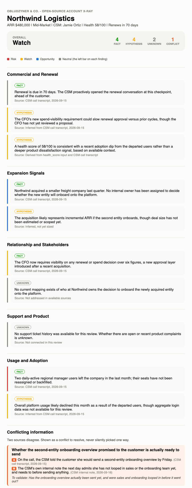

# Account X-Ray (open-source edition)

A zero-dependency tool that builds a full radiography of one B2B SaaS account from structured data and unstructured sources (call transcripts, CSM notes, emails), classifying every finding as Fact, Hypothesis, or Unknown, each with its source.

[](https://www.python.org/)
[](radiography.py)
[](LICENSE)
[](https://github.com/marianoobludzyner-hub)

**Jump to:** [What you get](#what-you-get) | [Who this is for](#who-this-is-for) | [Why this project](#why-this-project) | [Results](#results) | [How to run it](#how-to-run-it) | [Method](#method) | [How this connects to Obludzyner and Co.](#how-this-connects-to-obludzyner-and-co)

Part of the same open-source series as [nrr-leak-diagnostic](https://github.com/marianoobludzyner-hub/nrr-leak-diagnostic), [renewal-risk-rollup](https://github.com/marianoobludzyner-hub/renewal-risk-rollup), and [call-proactivity-analyzer](https://github.com/marianoobludzyner-hub/call-proactivity-analyzer), by [Mariano Obludzyner](https://github.com/marianoobludzyner-hub), founder of Obludzyner & Co. Those tools work at the company or portfolio level. This one goes deep on a single account, and reads unstructured sources, not just a spreadsheet row.

<p align="center">
  
</p>

<p align="center"><sub>Real output for a synthetic account, Northwind Logistics, built from a call transcript, a CSM note, and a structured CSV row - not a mockup. Open the actual report: <a href="examples/sample_radiography.html">sample_radiography.html</a>.</sub></p>

## What you get

- **One account, fully synthesized** - structured fields (ARR, health, renewal date) plus every unstructured source you have, in one report
- **Every finding classified** - Fact, Hypothesis, or Unknown, never blended together and never presented with more certainty than it has
- **A cited source on everything** - if a claim can't be traced to where it came from, it isn't a fact
- **Conflicts surfaced, not resolved in silence** - when two sources disagree, both sides get shown side by side with a question to go validate
- **Open questions, stated plainly** - the Unknowns section is usually the fastest next action, not a footnote
- **A self-contained HTML report** - one file, no dependencies to view it, readable before a renewal call or QBR in under a minute

## Who this is for

Founders, CEOs, and CS leaders prepping for a renewal call, a QBR, or an escalation, who have scattered information about an account (a call transcript here, a Slack note there, a CRM field somewhere else) and want it synthesized into one place without the synthesis quietly inventing confidence it doesn't have.

## Why this project

Most "account health" summaries blend what's known with what's assumed, and the reader can't tell which is which. This tool exists to make that distinction impossible to skip: every finding carries a classification and a source, and what genuinely isn't known gets stated as an open question instead of smoothed over or guessed at.

## Results

Worked example: Northwind Logistics, a synthetic mid-market account, $480,000 ARR, health score 58/100, renewing in 70 days. Built from a call transcript, a CSM's internal note, and a structured account row (all in [`examples/`](examples/)).

| Metric | Value |
|---|---|
| Overall | Watch |
| Findings | 10 total: 4 Fact, 4 Hypothesis, 2 Unknown |
| Conflicts | 1: the CSM told the customer an onboarding overview was coming Friday, but her own internal note admits sales and onboarding hadn't been looped in yet |
| Top risk | Two daily-active users left the company; seats not backfilled |
| Top opportunity | A recent acquisition means a second entity could onboard, currently unowned internally |
| Open questions | Who owns the decision to onboard the acquired entity; whether there's any recent support ticket activity |

Notice what the Hypothesis and Unknown counts are doing: 6 of 10 findings are not flat facts. A report that presented all 10 with equal confidence would be lying about how well this account is actually understood. The conflict is a different kind of gap entirely: two real sources, same account, genuinely disagreeing - the tool surfaces the tension instead of quietly trusting whichever source it read last.

## How to run it

The rendering logic (`radiography.py`) is pure Python standard library, zero installs, once you have a findings file:

```bash
python3 radiography.py examples/sample_findings.json examples/sample_radiography.html
# or a plain-text version:
python3 radiography.py examples/sample_findings.json --text
```

Building the findings file - reading the transcripts, notes, and structured data, and classifying each claim - is a judgment call an LLM makes, not something this script does. See below for the two ways this is actually meant to be used.

The findings JSON shape is documented in [`skill/SKILL.md`](skill/SKILL.md) and shown in full in [`examples/sample_findings.json`](examples/sample_findings.json).

## Run it as a Claude Skill

See [`skill/SKILL.md`](skill/SKILL.md). Point Claude at whatever you have on an account - a transcript, some notes, a CSV row - and ask for the x-ray. Claude reads it all, classifies every finding, and calls `radiography.py` to render the report.

## Run it as your own GPT

See [`gpt/CUSTOM_GPT_INSTRUCTIONS.md`](gpt/CUSTOM_GPT_INSTRUCTIONS.md) - paste it into a Custom GPT's instructions field (Code Interpreter enabled), then paste or upload whatever you have on the account directly in the chat.

## Method

Four rules, non-negotiable, applied to every finding:

1. **A fact needs a citable source.** If you can't point to where a claim came from, it's not a fact - it's a hypothesis at best.
2. **A hypothesis says so.** Reasonable inferences are useful and welcome, but never dressed up as something stated directly in a source.
3. **An unknown is stated, not skipped.** Silence reads as "nothing to see here." An explicit "we don't know this yet" reads as exactly what it is: the next thing to go find out.
4. **A conflict is shown, never silently resolved.** When two sources disagree on the same specific point, that disagreement is the finding. Picking whichever source seems more reliable and moving on erases the exact tension someone needs to go resolve. Every conflict in this tool's output ends with a concrete question to validate, not just a shrug.

This is the same discipline behind every account-level tool Obludzyner & Co. builds: never present more certainty than the data actually supports.

## How this connects to Obludzyner and Co.

This is "S", at maximum depth: the [SHIFT Method](https://obludzyner.com/#how)'s Signal step applied to one account instead of a whole portfolio. Proof the discipline matters at scale: at **Clicktale**, the audit that found the 60% renewal-cohort churn leak didn't get there by rounding uncertain numbers into confident ones - it got there by being precise about what was actually known.

**What changes with a real engagement:** this tool synthesizes what you already have. A real Revenue Audit also tells you what signals you're missing entirely (no health scoring, no usage data, no structured renewal process) and builds the system that closes those gaps, not just a report that flags them once. [Start the diagnostic](https://obludzyner.com/diagnostic) or [book a conversation](https://obludzyner.com/#contact).

## What this is not

This is a synthesis of what you feed it, not an independent investigation. It cannot know something no source mentioned, and it will not pretend to. If most of your report comes back Unknown, that's not a tool failure, that's the actual state of your account data, and it's worth taking seriously.

---

**Obludzyner & Co.** - Post-sales advisory for B2B SaaS. We install a commercial operating system that protects ARR and generates expansion in 90 days, without replacing your team or making you the bottleneck. [obludzyner.com](https://obludzyner.com) | [Start the diagnostic](https://obludzyner.com/diagnostic) | [Book a conversation](https://obludzyner.com/#contact) | [More open-source SHIFT Method tools](https://github.com/marianoobludzyner-hub)
